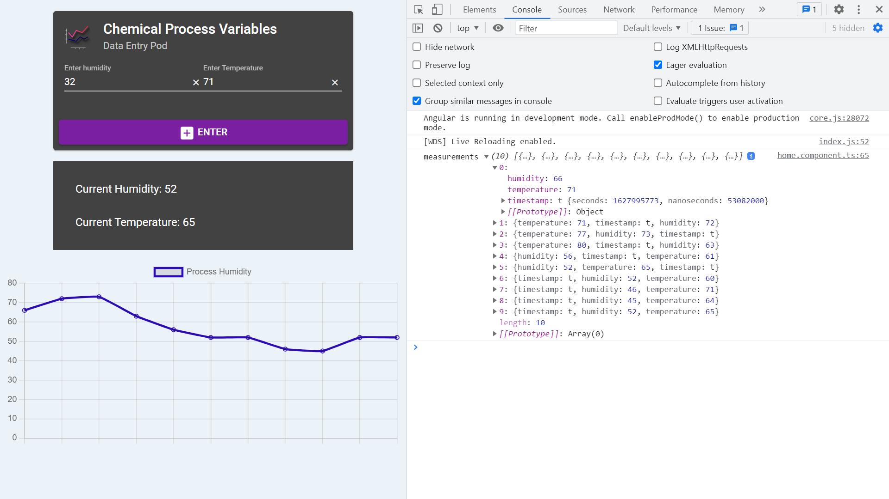

# Angular Python Charts

* Angular frontend chart display with a Firestore database backend
* **Note:** to open web links in a new window use: _ctrl+click on link_


## :page_facing_up: Table of contents

* [:zap: Angular Python Charts](#zap-angular-python-charts)
  * [:page_facing_up: Table of contents](#page_facing_up-table-of-contents)
  * [:books: General info](#books-general-info)
  * [:camera: Screenshots](#camera-screenshots)
  * [:signal_strength: Technologies](#signal_strength-technologies)
  * [:floppy_disk: Setup](#floppy_disk-setup)
  * [:flashlight: Testing](#flashlight-testing)
  * [:computer: Code Examples](#computer-code-examples)
  * [:cool: Features](#cool-features)
  * [:clipboard: Status & To-Do List](#clipboard-status--to-do-list)
  * [:clap: Inspiration](#clap-inspiration)
  * [:file_folder: License](#file_folder-license)
  * [:envelope: Contact](#envelope-contact)

## :books: General info

* Angular 12 frontend shows chart
* Python connects to Google Cloud Bigquery table using a JSON access key file in an /access directory (ignored by Git)
* Requires Pip module: google.cloud
* [Chart.js line chart](https://github.com/chartjs/Chart.js/blob/master/docs/charts/line.md#configuration-options) used to show data

## :camera: Screenshots



## :signal_strength: Technologies

* [Angular v12](https://angular.io/)
* [Python v3.9.5](https://www.python.org/)
* [Python package: google-cloud-firestore v2.2.0](https://pypi.org/project/google-cloud-firestore/)
* [npm Chart.js](https://www.chartjs.org/docs/3.1.1/)

## :floppy_disk: Setup

* `npm i` to install dependencies
* Install Python
* Install pip
* Install pip module using pip3 install --upgrade google-cloud-firestore
* Firebase console: create new project and add Firestore Database
* Add code

* **Frontend:** `ng serve` for a dev server. Navigate to `http://localhost:4200/` - app will automatically reload if you change any of the source files
* **Backend:** cd `/_pythonSensor` then run python `sim.py` to run Python code to generate data points

* `ng build --prod` for a build folder

## :flashlight: Testing

* `ng test` to execute the unit tests via [Karma](https://karma-runner.github.io).

## :computer: Code Examples

* template Angular Material components used to add values to chart

```html
<mat-card-content>
  <mat-form-field class="card-form-field">
    <mat-label>Enter humidity</mat-label>
    <input matInput type="text" [(ngModel)]="humiditySensorReading" />
    <button
      *ngIf="humiditySensorReading"
      matSuffix
      mat-icon-button
      aria-label="Clear"
      (click)="humiditySensorReading = ''"
    >
      <mat-icon>close</mat-icon>
    </button>
  </mat-form-field>
  <mat-form-field class="card-form-field">
    <mat-label>Enter Temperature</mat-label>
    <input matInput type="text" [(ngModel)]="temperatureSensorReading" />
    <button
      *ngIf="temperatureSensorReading"
      matSuffix
      mat-icon-button
      aria-label="Clear"
      (click)="temperatureSensorReading = ''"
    >
      <mat-icon>close</mat-icon>
    </button>
  </mat-form-field>
</mat-card-content>
```

## :cool: Features

* Real-time plotting of data points on Angular Chart

## :clipboard: Status & To-Do List

* Status: Working
* To-Do: Add temperature data points

## :clap: Inspiration

* [D-I-Ry: Real-time Dashboard Charting / Plotting](https://www.youtube.com/watch?v=PY4yjjcThos&t=378s)
* [Python docs: Unicode HOWTO](https://docs.python.org/3/howto/unicode.html)

## :file_folder: License

* This project is licensed under the terms of the MIT license.

## :envelope: Contact

* Repo created by [ABateman](https://github.com/AndrewJBateman), email: gomezbateman@yahoo.com
